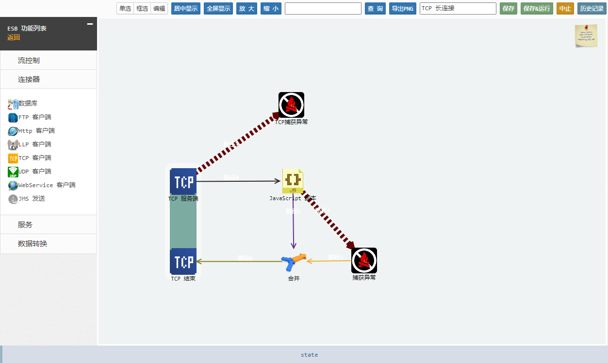

# EEB 中心控制端

> 在 node 0.10 下运行会出现内存溢出或进程崩溃的情况
> 不依赖中心端/运行节点的启动顺序

该项目由 [上海竹呗信息技术有限公司](https://xboson.net/) 提供技术支持.

### 安装

`npm install eeb-conductor-prj --save`

### 运行

`npm start`

### 程序配置

1. 本地数据存储位置
    config/config.js -- eeb_zy.local_db_dir 

2. 本地数据库配置
    config/config.js -- eeb_zy.log_db 

3. 平台引用配置
    config/config.js -- eeb_zy.port, eeb_zy.ip

4. 部分 UI 资源因自平台, 配置页面引用
    www/private/tag/setenv.htm, 
    修改 server-s 的设置, 修改 zy.g.host.ui, zy.g.host.api 的设置

### 配置页面

* [浏览器打开](http://localhost:8012/eeb/ui/index.htm) http://localhost:8012/eeb/ui/index.htm
* [通用测试服务](http://localhost:8012/eeb/service?fn=testhttp) http://localhost:8012/eeb/service?fn=testhttp

### 依赖

* [EEB 任务执行节点, 边缘运算节点](https://github.com/yanmingsohu/xBoson-virtuoso)
* [redis-server](http://www.redis.cn/)
* [kafka-server](http://kafka.apache.org/documentation.html)
* [zr-server](http://zr-i.com:8088/ui/login.html)
* [java](http://www.java.com/)
* [VS on windows](https://www.visualstudio.com/zh-cn/products/free-developer-offers-vs.aspx)
* [gcc on linux](http://gcc.gnu.org/)
* [Python27](https://www.python.org/download/releases/2.7/)

> redis 安装不正确会导致运行缓慢, kafka 不是必须的   
> 不再依赖平台 UI